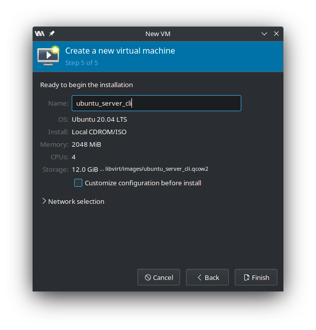
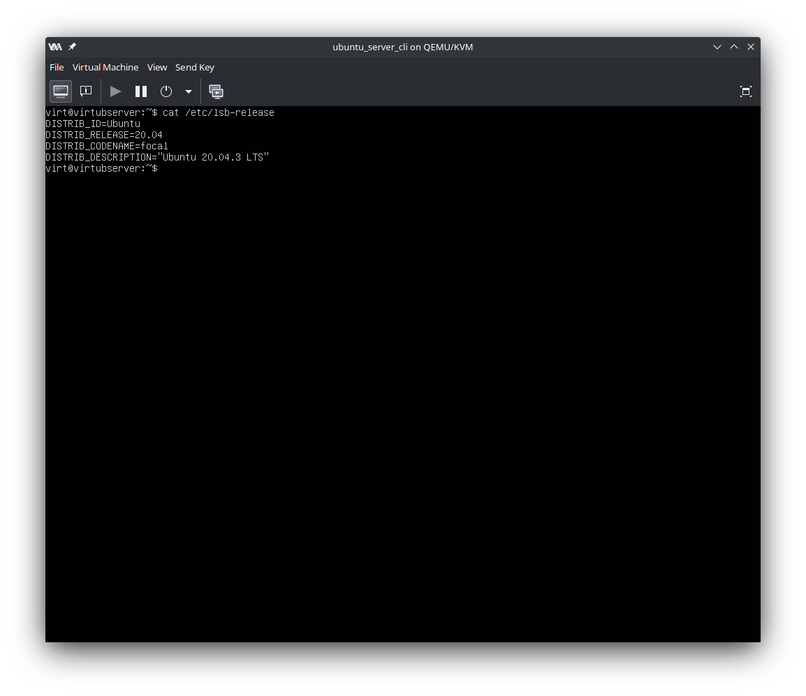

# Task 1

  Установка Ubuntu Server 20.04.3(LTS):

  Использовать в качестве виртуализации будем Qemu-KVM.

  Создание виртуальной машины

  Выберем скаченный образ

Установим:

- 2048mb -> 2G Ram
- 4 cpus

Создание виртуального диска 12Gb:

Даём название виртуальной машине

Результат:

Выберем обновление утановщика:

Ждем:

Оставим клавиатуру поумолчанию:

Сеть:

Выберавем ручную разбивку диска:

Указываем загрузчик

Разобьём диск так:

|swp|1G|
|:---:|:--:|
|boot|700Mb|
|/|Все остальное|

Указываем параметры профиля:

SSH будем устанавливать потом:

Пропустим установку дополнительных пакетов

Ждем завершение установки:

После перрезагрузки:

Проверяем наличие сети:

Устанавливаем openssh-server apt:

Виртуальная машина готова;

